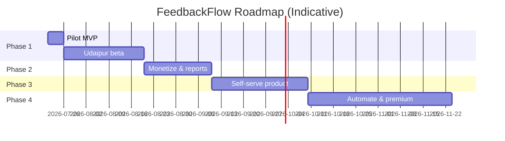

# Commiters FeedbackFlow — Phased Product Roadmap

**Product:** Commiters FeedbackFlow  
**Organization:** Commiters (Commit. Code. Connect.)  
**Document version:** 1.0  
**Last updated:** July 20, 2026  
**Status:** Approved for execution — Phase 1 starts first

---

## 1. Product Vision

FeedbackFlow is a **compliant, QR-powered customer feedback and reputation tool** for local businesses. It helps merchants:

- Make leaving a **Google review frictionless for every customer** (no review gating)
- Receive **instant alerts** when a customer shares negative private feedback
- Improve service in real time and build long-term Google Maps trust

For Commiters, FeedbackFlow is a **micro-SaaS and lead-generation engine** that opens upsell paths to websites, WhatsApp automation, and AI systems.

**Positioning (external):** Customer Experience & Reputation Platform  
**Working name (internal / MVP):** Commiters FeedbackFlow  
**Tagline:** *Turn unhappy customers into repeat customers before they become public complaints.*

---

## 2. Guiding Principles (All Phases)

These apply across every phase. Non-negotiable.

| Principle | Rule |
|-----------|------|
| **Google compliance** | Every customer gets the **same access** to the Google review option. No sentiment-based routing, hiding, or discouraging negative reviewers. |
| **Privacy by design** | Collect only data needed for the current phase. Explicit consent before any personal data in later phases. |
| **Merchant reality** | Owners want **alerts and summaries**, not dashboards they never open. Build for WhatsApp/email first. |
| **Sell before over-build** | Validate with 3 live Udaipur businesses before adding self-serve, payments, or AI. |
| **Commiters leverage** | Every customer touchpoint includes subtle **"Powered by Commiters"** branding for B2B lead gen. |

---

## 3. Phase Overview



| Phase | Name | Duration | Goal | Revenue |
|-------|------|----------|------|---------|
| **1** | Pilot MVP | ~5 days build + 30-day beta | 3 cafés actively using laminated QR | Free trial |
| **2** | Monetize | ~3 weeks | 3–10 paying clients, weekly reports | ₹499–999/mo |
| **3** | Productize | ~4 weeks | Self-serve merchant onboarding, multi-QR | Scale subscriptions |
| **4** | Automate & Premium | ~6 weeks | API WhatsApp, AI insights, GBP health | Premium tier |

---

## 4. Phase 1 — Pilot MVP

**Objective:** Ship the smallest compliant product that a real café can use tomorrow.

### Deliverables

- Public QR landing page per business (`/r/{slug}`)
- Google review as **primary CTA** for all visitors
- Optional private feedback path (internal stars + comment)
- Owner alerts via **email** or **`wa.me` pre-filled link** (no WhatsApp API)
- Hidden Commiters admin: manually create/edit businesses
- Rate limiting + bot protection on public endpoints
- Deployed to production (Vercel + PostgreSQL)

### Explicitly out of scope

- Merchant self-signup, login, password reset
- Customer name / phone collection
- Dashboard, charts, analytics UI
- Payment gateway (Razorpay/Stripe)
- Twilio/Gupshup WhatsApp API
- Table-level / multi-location QR
- AI sentiment analysis
- Acrylic stands (use laminated A4)

### Success criteria

- 3 Udaipur cafés/restaurants with QR live for 30 days
- ≥50 total scans across pilots
- ≥1 owner-reported “caught issue before public review” story
- Zero Google policy complaints from pilot merchants

### Detailed requirements

See **[PHASE_1_MVP_BRD.md](./PHASE_1_MVP_BRD.md)**.

---

## 5. Phase 2 — Monetize & Retain

**Objective:** Convert pilots to paying clients and prove recurring value without a heavy dashboard.

**Prerequisite:** Phase 1 complete with ≥3 active pilots and qualitative feedback.

### Deliverables

| Feature | Description |
|---------|-------------|
| **Weekly owner report** | Automated Monday summary: scans, Google clicks, feedback count, top themes (manual categorization initially) |
| **Simple admin improvements** | List businesses, toggle active, view feedback log, export CSV |
| **Billing (manual v2.0)** | UPI/invoice for ₹2,999 setup + ₹499/mo; no in-app payment yet |
| **Merchant one-pager** | Printable PDF: how to use FeedbackFlow, Google compliance dos/don’ts for staff |
| **Case study template** | 1-pager for Commiters portfolio from best pilot |
| **Premium tier prep** | Weekly report + priority support at ₹999/mo (manual delivery) |

### Success criteria

- ≥3 paying businesses by end of Phase 2
- ≥70% pilot-to-paid conversion (of willing pilots)
- Monthly churn &lt;20% in first 90 days
- Commiters closes ≥1 website or automation upsell from FeedbackFlow clients

### Out of scope (Phase 2)

- Merchant self-login
- Automated payment collection
- WhatsApp Business API
- Multi-location QR

---

## 6. Phase 3 — Productize (Self-Serve Micro-SaaS)

**Objective:** Reduce Commiters manual ops so the product can scale beyond hand-held onboarding.

**Prerequisite:** ≥5 paying clients, proven pricing, stable compliant UX.

### Deliverables

| Feature | Description |
|---------|-------------|
| **Merchant authentication** | Email + password (Argon2/bcrypt), email verification, password reset |
| **Merchant dashboard (minimal)** | View feedback log, download QR PNG/SVG, edit Google review URL and alert contacts |
| **Multi-QR per business** | Location labels (e.g. `table-1`, `counter`) with `@@unique([businessId, identifier])` |
| **QR asset generator** | Branded QR card PDF with business name + “Powered by Commiters” |
| **Privacy compliance layer** | Consent checkbox if collecting optional contact info; privacy policy URL per business; data retention config |
| **DPDP-ready schema** | `consentGiven`, `consentAt`, `deletedAt`, retention purge job |
| **Row-level security** | Business-scoped API middleware; tenant isolation tests |
| **In-app billing** | Razorpay subscriptions: Starter ₹499/mo, Premium ₹999/mo, Setup fee ₹2,999 |

### Success criteria

- ≥2 merchants onboarded fully self-serve (no Commiters manual DB entry)
- Zero cross-tenant data leaks in security review
- ≥10 total paying businesses
- Support load &lt;2 hrs/week per 10 merchants

### Out of scope (Phase 3)

- WhatsApp API automation
- AI sentiment
- Competitor benchmarking
- Mobile app

---

## 7. Phase 4 — Automate & Premium

**Objective:** Full-featured micro-SaaS with premium differentiation and reduced manual reporting.

**Prerequisite:** Stable self-serve core, merchant WABA relationships or Commiters-managed notification channel.

### Deliverables

| Feature | Description |
|---------|-------------|
| **WhatsApp Business API** | Template-approved alerts for low ratings; weekly digest template |
| **AI sentiment tagging** | Auto-tag feedback themes (food, service, wait time, cleanliness) via Gemini |
| **Google Business Profile health** | Display: total reviews, avg rating, last review date (read-only widget) |
| **Analytics dashboard** | Scans over time, Google click-through rate, feedback trends |
| **Competitor snapshot** | Nearby category average rating (manual or Places API) |
| **Premium tier (automated)** | ₹999/mo: AI insights + weekly WhatsApp digest + GBP health |
| **White-label option** | Remove/minimize Commiters branding for agency resale (future pricing) |
| **API webhooks** | Notify external systems on new feedback (for Commiters automation upsells) |

### Success criteria

- ≥20 paying businesses (mix of Core and Premium)
- Premium attach rate ≥25%
- WhatsApp template approval pipeline &lt;5 days for new merchants
- MRR target: ₹15,000+ (illustrative; adjust based on Phase 2–3 actuals)

---

## 8. Revenue Model (Full Product)

| Tier | Price | Phase introduced |
|------|-------|------------------|
| **Setup** | ₹2,999 one-time | Phase 2 (manual) → Phase 3 (in-app) |
| **Core** | ₹499/month | Phase 2 |
| **Premium** | ₹999/month | Phase 2 (manual) → Phase 4 (automated) |
| **Pilot** | Free 30 days | Phase 1 |

**Bundled:** WhatsApp API message costs included in Premium once Phase 4 ships.

**Commiters upsell path (primary revenue long-term):**

```
FeedbackFlow → Website → WhatsApp ordering → AI chatbot
Target: ₹20,000–₹50,000 per client beyond SaaS fees
```

---

## 9. Technical Architecture (Target State)

Evolution by phase — not all built on day one.

| Layer | Phase 1 | Phase 3+ |
|-------|---------|----------|
| **Frontend** | Next.js App Router, Tailwind, mobile-first | + Merchant dashboard |
| **Backend** | Next.js API routes / server actions | + Webhooks |
| **Database** | PostgreSQL (Supabase/Neon) + Prisma | + RLS policies |
| **Auth** | Env-protected admin only | Merchant sessions + email verify |
| **Hosting** | Vercel edge | Same |
| **Alerts** | Email / `wa.me` | WhatsApp API (Twilio/Gupshup) |
| **AI** | — | Gemini sentiment (Phase 4) |
| **Payments** | Manual UPI | Razorpay (Phase 3) |

---

## 10. Compliance & Risk Register

| Risk | Impact | Mitigation | Phase |
|------|--------|------------|-------|
| Review gating | Google profile penalties | Equal Google CTA for all users; merchant compliance guide | 1+ |
| On-premises pressure | 2026 policy violation | Train merchants: no staff pushing reviews at table | 1+ |
| DPDP (India) | Legal exposure | No PII in Phase 1; consent + retention in Phase 3 | 1, 3 |
| FTC (US market) | Fines if US clients | Same equal-access flow; no suppression | 3+ if US |
| WhatsApp template delays | Blocked alerts | `wa.me` / email fallback | 1–3 |
| Multi-tenant data leak | Trust destruction | RLS + scoped middleware + tests | 3 |
| Low distribution | Product dies unused | Udaipur café-only GTM; physical visits | 1–2 |
| Founder overload | Missed timelines | Ruthless scope per phase; manual ops OK early | All |

---

## 11. Go-to-Market by Phase

### Phase 1 — Udaipur café pilot

- **ICP:** Independent cafés and small restaurants, lakeside Udaipur
- **Offer:** Free 30-day install; Commiters sets up everything
- **Collateral:** Laminated A4 QR, 30-second verbal pitch
- **Targets:** JMB, Cafe Edelweiss, +8 walk-ins
- **Goal:** 3 active users

### Phase 2 — Convert & reference

- Convert pilots at ₹499/mo (waive setup for case study)
- Ask for Google review of Commiters + photo of QR in use
- Publish 1 case study on commiters.in

### Phase 3 — Expand niche

- Self-serve signup with Udaipur + Rajasthan hospitality focus
- Partner with print shops for QR stand upsell
- Referral: ₹500 credit for merchant referrals

### Phase 4 — Premium & agency

- Pitch Premium to businesses with ≥100 scans/month
- Package FeedbackFlow into Commiters website + automation bundles

---

## 12. Document Index

| Document | Purpose |
|----------|---------|
| [PHASE_1_MVP_BRD.md](./PHASE_1_MVP_BRD.md) | Business requirements for current build |
| [PHASE_1_USER_STORIES.md](./PHASE_1_USER_STORIES.md) | Phase 1 user stories and acceptance criteria |
| [PHASE_1_USE_CASES.md](./PHASE_1_USE_CASES.md) | Formal use cases with flows and traceability |
| [PHASE_1_ARCHITECTURE.md](./PHASE_1_ARCHITECTURE.md) | Technical architecture and system design |
| [PHASE_1_IMPLEMENTATION.md](./PHASE_1_IMPLEMENTATION.md) | TDD implementation plan for Phase 1 MVP |
| [../README.md](../README.md) | Project setup, deployment, and structure |
| `Commiters_Review_Booster_Action_Plan.pdf` | Original concept (superseded on compliance) |
| Future: `MERCHANT_COMPLIANCE_GUIDE.md` | Google policy guide for clients |

---

## 13. Decision Log

| Date | Decision | Rationale |
|------|----------|-----------|
| 2026-07-20 | Reject star-routing gating flow | Google 2026 enforcement + FTC review suppression rules |
| 2026-07-20 | Google CTA primary on landing | Compliance + higher conversion vs survey-first |
| 2026-07-20 | No merchant auth in Phase 1 | 20–30% dev savings; manual onboarding for first 10 |
| 2026-07-20 | No customer PII in Phase 1 | Friction reduction + minimal DPDP surface |
| 2026-07-20 | `wa.me` over WhatsApp API in Phase 1 | Zero template approval delay, zero API cost |
| 2026-07-20 | Cafés/restaurants only for GTM | Focus beats broad “all local businesses” |
| 2026-07-20 | Domain: `feedbackflow.commiters.in` | Subdomain on existing `commiters.in` — no new domain or hosting cost |
| 2026-07-20 | Email: existing Commiters SMTP | No new email service subscription |
| 2026-07-20 | Admin: minimal `/admin` page | Env-protected; sufficient for pilot onboarding |

---

*Next step: Implement Phase 1 per [PHASE_1_MVP_BRD.md](./PHASE_1_MVP_BRD.md). Technical specification and code begin after BRD sign-off.*
