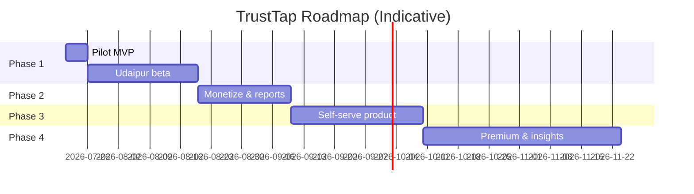

# Commiters TrustTap — Phased Product Roadmap

**Product:** Commiters TrustTap  
**Organization:** Commiters (Commit. Code. Connect.)  
**Document version:** 1.1  
**Last updated:** July 26, 2026  
**Status:** Approved for execution — Phase 1 starts first

---

## 1. Product Vision

TrustTap is a **compliant, QR-powered customer feedback and reputation tool** for local businesses. It helps merchants:

- Make leaving a **Google review frictionless for every customer** (no review gating)
- Receive **instant phone alerts** when a customer shares negative private feedback
- Improve service in real time and build long-term Google Maps trust

For Commiters, TrustTap is a **micro-SaaS and lead-generation engine** that opens upsell paths to websites, WhatsApp automation, and AI systems.

**Positioning (external):** Customer Experience & Reputation Platform  
**Working name:** Commiters TrustTap  
**Tagline:** *Turn unhappy customers into repeat customers before they become public complaints.*

**Competitive frame:** Static ₹1,000–1,500 “lifetime QR boards” (Google / Instagram / UPI) are print products with no private recovery path and no updateable system. TrustTap sells a **review recovery system** — not a poster.

---

## 2. Guiding Principles (All Phases)

These apply across every phase. Non-negotiable.

| Principle | Rule |
|-----------|------|
| **Google compliance** | Every customer gets the **same access** to the Google review option. No sentiment-based routing, hiding, or discouraging negative reviewers. |
| **Privacy by design** | Collect only data needed for the current phase. Explicit consent before any personal data in later phases. |
| **Merchant reality** | Local owners (cafés, barbers) live on **WhatsApp**, not email or dashboards. Primary alerts must buzz the phone automatically. |
| **No human alert relay** | Never staff a person to watch the admin log and manually WhatsApp owners. Alerts are system-sent. |
| **Sell before over-build** | Validate with 3 live Udaipur businesses before adding self-serve, payments, or AI. |
| **Commiters leverage** | Every customer touchpoint includes subtle **"Powered by Commiters"** branding for B2B lead gen. |
| **Honest limits** | Compliant Google access means some customers may still post public negative Google reviews. TrustTap’s value is early private warning + faster response — not “zero bad Google reviews.” |

---

## 3. Phase Overview

| Phase | Name | Duration | Goal | Revenue |
|-------|------|----------|------|---------|
| **1** | Pilot MVP | ~5–8 days build + 30-day beta | 3 cafés with laminated QR + **automated phone alerts** | Free trial |
| **2** | Monetize | ~3 weeks | 3–10 paying clients, weekly reports | ₹499–999/mo |
| **3** | Productize | ~4 weeks | Self-serve merchant onboarding, multi-QR | Scale subscriptions |
| **4** | Premium & insights | ~6 weeks | Digests, AI insights, GBP health | Premium tier |

---

## 4. Phase 1 — Pilot MVP

**Objective:** Ship the smallest compliant product that a real café/barber can use tomorrow — with alerts they will actually see.

### Deliverables

- Public QR landing page per business (`/r/{slug}`) with **business name** prominent
- Google review as **primary CTA** for all visitors (equal access; no gating)
- Optional private feedback path (internal stars + comment; anonymous)
- Owner alerts on rating ≤ 3:
  - **Primary (Must):** automated **WhatsApp Business API** *or* automated **SMS**
  - **Secondary (Must):** email backup via Commiters SMTP
- Hidden Commiters admin: create/edit/deactivate businesses, feedback log, QR PNG
- **Physical pilot kit:** laminated QR with **shop name printed** on the board
- Rate limiting + bot protection on public endpoints
- Deployed to production (Vercel + PostgreSQL)

### Explicitly out of scope

- Merchant self-signup, login, password reset
- Customer name / phone collection
- Merchant analytics dashboard / charts
- Payment gateway (Razorpay/Stripe)
- Instagram / UPI / multi-link QR product (don’t copy static 3-QR boards into the app)
- **Manual staff WhatsApp relay** (watching dashboard to ping owners)
- Table-level / multi-location QR
- AI sentiment analysis
- Acrylic stands (use laminated A4 / card with shop name)

### Success criteria

- 3 Udaipur pilots with QR live for 30 days
- ≥50 total scans across pilots
- ≥1 owner-reported “caught issue before public review” story
- Owner confirms **phone alert** received on a test ≤3★ within ~60 seconds
- Zero Google policy complaints from pilot merchants

### Competitive win vs static QR boards

| Static ₹1,500 board | TrustTap Phase 1 |
|---------------------|------------------|
| Print + static links | Print **+** live system |
| Google (and maybe Instagram/UPI) | Google + **private recovery** |
| Often “lifetime, no support” | Commiters onboarding + URL fixes |
| Relies on Google’s own review emails | **Automated WhatsApp/SMS** on private low ratings |
| No feedback log | Admin log of clicks + private feedback |

### Detailed requirements

See **[PHASE_1_MVP_BRD.md](./PHASE_1_MVP_BRD.md)**.

---

## 5. Phase 2 — Monetize & Retain

**Objective:** Convert pilots to paying clients and prove recurring value without a heavy dashboard.

**Prerequisite:** Phase 1 complete with ≥3 active pilots and qualitative feedback.

### Deliverables

| Feature | Description |
|---------|-------------|
| **Weekly owner report** | Automated Monday summary: scans, Google clicks, feedback count (WhatsApp or email) |
| **Simple admin improvements** | List businesses, toggle active, view feedback log, export CSV |
| **Billing (manual v2.0)** | UPI/invoice for ₹2,999 setup + ₹499/mo; no in-app payment yet |
| **Merchant one-pager** | Printable PDF: how to use TrustTap, Google compliance dos/don’ts for staff |
| **Case study template** | 1-pager for Commiters portfolio from best pilot |
| **Premium tier prep** | Weekly report + priority support at ₹999/mo |
| **Alert reliability polish** | Template variants, SMS fallback if WhatsApp fails, delivery status in admin |

### Success criteria

- ≥3 paying businesses by end of Phase 2
- ≥70% pilot-to-paid conversion (of willing pilots)
- Monthly churn &lt;20% in first 90 days
- Commiters closes ≥1 website or automation upsell from TrustTap clients

### Out of scope (Phase 2)

- Full merchant self-serve signup
- AI sentiment
- In-app Razorpay

---

## 6. Phase 3 — Productize (Self-Serve)

**Objective:** Merchants can onboard without Commiters creating every business by hand.

### Deliverables

| Feature | Description |
|---------|-------------|
| **Merchant authentication** | Email + password, email verification, password reset |
| **Merchant dashboard (minimal)** | Feedback log, QR download, edit Google URL and alert contacts |
| **Self-serve business create** | Guided Google review URL setup |
| **Multi-QR / locations** | Optional second location labels |
| **In-app billing** | Razorpay: Starter ₹499/mo, Premium ₹999/mo, Setup ₹2,999 |

### Success criteria

- Zero cross-tenant data leaks in security review
- ≥10 total paying businesses
- Support load &lt;2 hrs/week per 10 merchants

### Out of scope (Phase 3)

- AI sentiment
- Competitor benchmarking
- Mobile app

---

## 7. Phase 4 — Premium & Insights

**Objective:** Premium differentiation. *(Incident WhatsApp/SMS alerts already shipped in Phase 1.)*

### Deliverables

| Feature | Description |
|---------|-------------|
| **WhatsApp weekly digest** | Template digest (beyond incident alerts) |
| **AI sentiment tagging** | Auto-tag themes via Gemini |
| **Google Business Profile health** | Reviews count, avg rating, last review date |
| **Analytics dashboard** | Scans, Google CTR, feedback trends |
| **Competitor snapshot** | Nearby category average rating |
| **Premium tier** | ₹999/mo: AI + weekly digest + GBP health |
| **White-label / webhooks** | Agency and automation upsells |

### Success criteria

- ≥20 paying businesses
- Premium attach rate ≥25%
- MRR target: ₹15,000+ (illustrative)

---

## 8. Revenue Model (Full Product)

| Tier | Price | Phase introduced |
|------|-------|------------------|
| **Setup** | ₹2,999 one-time | Phase 2 → Phase 3 |
| **Core** | ₹499/month | Phase 2 |
| **Premium** | ₹999/month | Phase 2 → Phase 4 digests |
| **Pilot** | Free 30 days | Phase 1 |

**Bundled:** Per-message cost for **incident** WhatsApp/SMS alerts included in Core from Phase 1 (absorb or pass-through — decide at pilot pricing).

**Upsell path:** TrustTap → Website → WhatsApp ordering → AI chatbot (₹20,000–₹50,000+ beyond SaaS).

---

## 9. Technical Architecture (Target State)

| Layer | Phase 1 | Phase 3+ |
|-------|---------|----------|
| **Frontend** | Next.js App Router, Tailwind, mobile-first | + Merchant dashboard |
| **Backend** | Next.js API routes | + Webhooks |
| **Database** | PostgreSQL + Prisma | + RLS |
| **Auth** | Env admin only | Merchant sessions |
| **Hosting** | Vercel | Same |
| **Alerts** | **WhatsApp API and/or SMS (primary)** + email backup | + Digests |
| **AI** | — | Gemini (Phase 4) |
| **Payments** | Manual UPI | Razorpay (Phase 3) |

---

## 10. Compliance & Risk Register

| Risk | Impact | Mitigation | Phase |
|------|--------|------------|-------|
| Review gating | Google penalties | Equal Google CTA; compliance guide | 1+ |
| Public bad Google review after CTA | Owner disappointment | Honest sales script; private path + response playbook | 1+ |
| Owner ignores email | Missed alerts | Phone channel primary; email backup only | 1 |
| Manual alert ops | Staff overload | **Forbidden** — automate WhatsApp/SMS | 1 |
| WhatsApp template delays | Blocked WA | SMS fallback + email | 1–2 |
| Static-board price war | Race to ₹1,500 | Sell recovery + alerts + support; free pilot then SaaS | 1–2 |
| DPDP | Legal exposure | No PII Phase 1; consent Phase 3 | 1, 3 |

---

## 11. Go-to-Market by Phase

### Phase 1 — Udaipur pilot

- **ICP:** Cafés, small restaurants, barbers/local shops that care about Google reputation
- **Offer:** Free 30-day install; Commiters sets up everything
- **Collateral:** Laminated QR **with shop name**
- **Pitch:** “Google already notifies you *after* a public review. We WhatsApp/SMS you when someone is unhappy *privately* — so you can fix it first.”
- **Do not pitch:** Instagram/UPI multi-QR, “we stop all bad Google reviews,” email-only alerts

### Phase 2+

- Convert on weekly proof; price against saved complaints, not print-board cost

---

## 12. Document Index

| Document | Purpose |
|----------|---------|
| **PHASED_ROADMAP.md** | This document |
| [PHASE_1_MVP_BRD.md](./PHASE_1_MVP_BRD.md) | Phase 1 BRD |
| [PHASE_1_USER_STORIES.md](./PHASE_1_USER_STORIES.md) | User stories |
| [PHASE_1_USE_CASES.md](./PHASE_1_USE_CASES.md) | Use cases |
| [PHASE_1_ARCHITECTURE.md](./PHASE_1_ARCHITECTURE.md) | Architecture |
| [PHASE_1_IMPLEMENTATION.md](./PHASE_1_IMPLEMENTATION.md) | TDD plan |
| [PHASE_1_DEPLOY.md](./PHASE_1_DEPLOY.md) | Deploy runbook |
| [PHASE_1_E2E_MANUAL_TEST_GUIDE.md](./PHASE_1_E2E_MANUAL_TEST_GUIDE.md) | Manual E2E |
| [PHASE_1_BETA_CHECKLIST.md](./PHASE_1_BETA_CHECKLIST.md) | Beta ops |

---

*Scope rule: if it is not in the current phase deliverables table, it is not in the sprint.*
