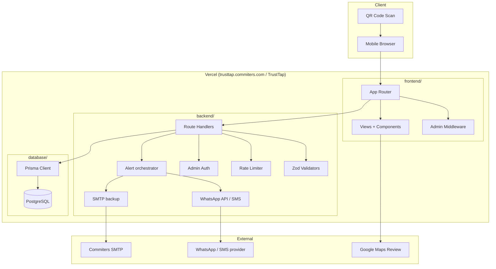
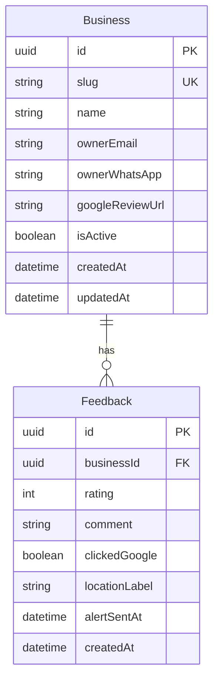
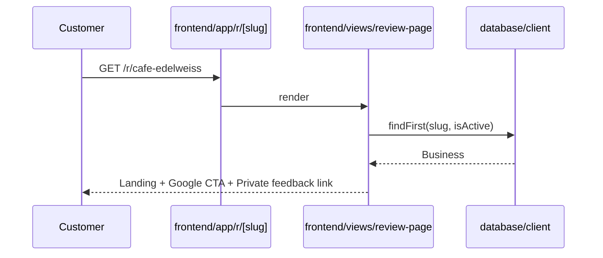
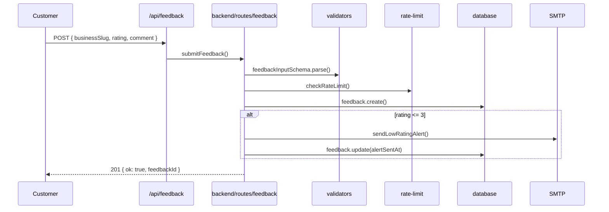
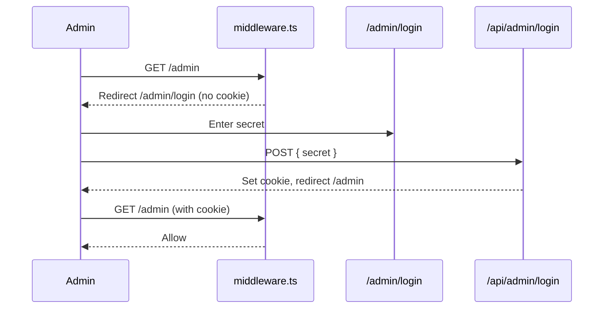
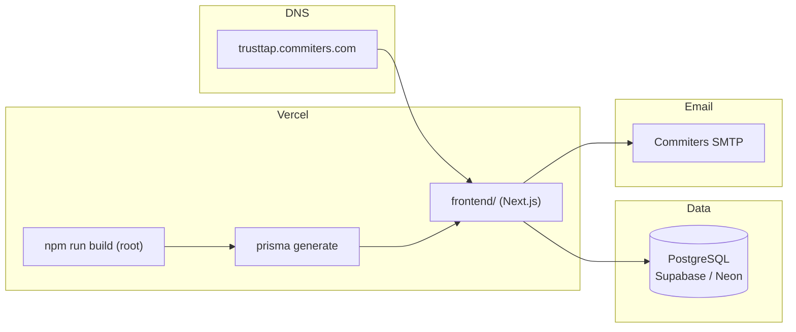

# Phase 1 MVP — Architecture Document

**Product:** Commiters TrustTap  
**Phase:** 1 — Pilot MVP  
**Version:** 1.1  
**Last updated:** July 26, 2026  
**Related documents:** [PHASE_1_USE_CASES.md](./PHASE_1_USE_CASES.md) · [PHASE_1_IMPLEMENTATION.md](./PHASE_1_IMPLEMENTATION.md) · [PHASE_1_MVP_BRD.md](./PHASE_1_MVP_BRD.md)

---

## 1. Architecture Overview

TrustTap Phase 1 is a **monolithic Next.js application** organized into three logical layers deployed as a single Vercel project:

| Layer | Folder | Responsibility |
|-------|--------|----------------|
| **Frontend** | `frontend/` | UI, routing, middleware, customer + admin views |
| **Backend** | `backend/` | API handlers, business logic, validation, **alerts** (WhatsApp/SMS + email), auth |
| **Database** | `database/` | Prisma schema, migrations, client |

Next.js requires the App Router at `frontend/app/`. The frontend imports backend and database modules via TypeScript path aliases. Vercel deploys from `frontend/` with `externalDir` enabled to resolve sibling folders.

---

## 2. High-Level Architecture



---

## 3. Repository Structure

```text
GoogleReviewQR/
├── frontend/                     # Next.js application root
│   ├── app/                      # App Router (thin re-exports)
│   │   ├── layout.tsx
│   │   ├── page.tsx
│   │   ├── not-found.tsx
│   │   ├── admin/
│   │   ├── r/[slug]/
│   │   └── api/                  # Thin wrappers → backend/routes
│   ├── components/               # Reusable UI components
│   ├── views/                    # Page-level view components
│   ├── styles/globals.css
│   ├── middleware.ts             # Admin route protection
│   ├── next.config.ts
│   ├── vercel.json               # Install/build when Vercel Root Directory = frontend
│   └── tsconfig.json
│
├── backend/
│   ├── routes/                   # API handler implementations
│   │   ├── feedback.ts
│   │   ├── google-click.ts
│   │   ├── health.ts
│   │   └── admin-login.ts
│   ├── lib/
│   │   ├── auth/                 # Admin secret + cookie validation
│   │   ├── email/                # SMTP backup alerts
│   │   ├── alerts/               # shouldTriggerAlert + phone/email orchestrator
│   │   ├── phone/                # Twilio WhatsApp / SMS (Phase 1 Must)
│   │   ├── validators/           # Zod schemas
│   │   ├── env.ts
│   │   ├── http.ts
│   │   └── rate-limit.ts
│   ├── scripts/seed-pilot.ts
│   └── vitest.config.ts          # TDD test runner config
│
├── database/
│   ├── schema.prisma
│   ├── migrations/
│   ├── client.ts                 # Prisma singleton
│   └── index.ts
│
├── docs/                         # Product + technical documentation
├── package.json                  # Root scripts orchestrate all layers
├── .env.example
├── .env.production.example
└── vercel.json                   # Fallback; prefer frontend/vercel.json + Root Directory=frontend
```

---

## 4. Layer Responsibilities

### 4.1 Frontend (`frontend/`)

| Component | Purpose |
|-----------|---------|
| `app/` | Next.js routing only — re-exports views and backend routes |
| `views/` | Server/client page components (renamed from `pages/` to avoid Next.js conflict) |
| `components/` | Shared UI (forms, buttons, admin widgets) |
| `middleware.ts` | Protects `/admin/*` except `/admin/login` |
| `styles/` | Tailwind global CSS |

**Design rule:** No business logic in `frontend/app/`. Views may fetch data; mutations go through `backend/routes/`.

### 4.2 Backend (`backend/`)

| Module | Purpose |
|--------|---------|
| `routes/` | Request handlers called by `frontend/app/api/*/route.ts` |
| `lib/validators/` | Input validation (Zod) |
| `lib/rate-limit.ts` | In-memory IP rate limiting (Phase 1) |
| `lib/auth/` | Admin secret verification, session cookie |
| `lib/email/smtp.ts` | Backup low-rating emails |
| `lib/alerts/*` | Trigger rules + orchestrator (phone primary, email secondary) |
| `lib/phone/*` | WhatsApp Business API and/or SMS gateway clients |
| `lib/env.ts` | Typed environment variable validation |

**Design rule:** All testable logic lives here. TDD tests co-located as `*.test.ts`.

### 4.3 Database (`database/`)

| Asset | Purpose |
|-------|---------|
| `schema.prisma` | Business + Feedback models |
| `migrations/` | Version-controlled SQL migrations |
| `client.ts` | Singleton PrismaClient (dev hot-reload safe) |

---

## 5. Data Model



### Entity notes

- **Business.slug** — URL-safe, globally unique (one QR per business in Phase 1).
- **Feedback.rating** — Internal only; never used to gate Google CTA.
- **Feedback.clickedGoogle** — Tracks Google CTA engagement separately from private feedback.
- **Feedback.alertSentAt** — Idempotency guard for owner alerts (phone + email orchestration).

---

## 6. API Design

| Method | Path | Handler | Auth | Purpose |
|--------|------|---------|------|---------|
| GET | `/api/health` | `backend/routes/health.ts` | Public | Deploy health check |
| POST | `/api/feedback` | `backend/routes/feedback.ts` | Public + rate limit | Submit private feedback |
| POST | `/api/google-click` | `backend/routes/google-click.ts` | Public | Log Google CTA click |
| POST | `/api/admin/login` | `backend/routes/admin-login.ts` | Public | Admin session login |
| DELETE | `/api/admin/login` | `backend/routes/admin-login.ts` | Cookie | Admin logout |

Future Phase 1 admin APIs (to be implemented):

| Method | Path | Purpose |
|--------|------|---------|
| GET/POST | `/api/admin/businesses` | List / create businesses |
| PUT | `/api/admin/businesses/[id]` | Update business |
| GET | `/api/admin/feedback` | List feedback by business |
| GET | `/api/admin/qr/[slug]` | Download QR PNG |

---

## 7. Request Flows

### 7.1 Customer landing (read)



### 7.2 Private feedback submission (write)



### 7.3 Admin access



---

## 8. Security Architecture

| Control | Implementation | Location |
|---------|----------------|----------|
| Admin auth | Env secret + httpOnly cookie | `backend/lib/auth/`, `frontend/middleware.ts` |
| Timing-safe secret compare | `crypto.timingSafeEqual` | `backend/lib/auth/admin.ts` |
| Rate limiting | In-memory per IP + business slug | `backend/lib/rate-limit.ts` |
| Bot protection | Honeypot field on feedback form | `backend/lib/validators/` |
| Input validation | Zod schemas | `backend/lib/validators/` |
| No customer PII | Schema excludes name/phone | `database/schema.prisma` |
| HTTPS | Vercel automatic SSL | Infrastructure |
| Secure cookie | `secure: true` in production | `backend/routes/admin-login.ts` |

### Phase 1 limitations (accepted)

- In-memory rate limit resets on deploy (no Redis).
- Single shared admin secret (no multi-admin RBAC).
- No CAPTCHA (honeypot only).

---

## 9. Compliance Architecture

The system enforces Google-compliant behavior at **three layers**:

| Layer | Enforcement |
|-------|-------------|
| **UI** | Google CTA always rendered on landing + thank-you; no sentiment-conditional copy |
| **Backend** | No branch logic on rating for Google redirect; validators do not gate routes |
| **Tests** | Compliance tests assert no gating logic exists (see Phase 1 Implementation doc) |

**Explicitly prohibited in code:**
```typescript
// NEVER implement this pattern
if (rating >= 4) { showGoogleReview(); } else { showPrivateFormOnly(); }
```

---

## 10. Deployment Architecture



| Setting | Value |
|---------|-------|
| Domain | `trusttap.commiters.com` |
| Vercel Root Directory | `frontend/` |
| Install / build | `frontend/vercel.json` → `cd .. && npm ci` / `npm run build` |
| Region | `bom1` (Mumbai) |
| Database | Managed PostgreSQL with daily backups |
| Email | Existing Commiters SMTP via env vars |
| Phone alerts | Twilio WhatsApp and/or SMS |

---

## 11. Environment Variables

| Variable | Layer | Required | Purpose |
|----------|-------|----------|---------|
| `DATABASE_URL` | database | Yes | PostgreSQL connection |
| `ADMIN_SECRET` | backend | Yes | Admin authentication |
| `BASE_URL` | backend | Yes | Public URL for QR generation (`https://trusttap.commiters.com`) |
| `SMTP_HOST/PORT/USER/PASS/FROM` | backend | Yes | Backup email alerts |
| `ALERT_PHONE_MODE` | backend | Yes | `log` (dev) or `twilio` (production) |
| `TWILIO_ACCOUNT_SID` / `TWILIO_AUTH_TOKEN` | backend | When mode=`twilio` | Twilio auth |
| `TWILIO_SMS_FROM` / `TWILIO_WHATSAPP_FROM` | backend | When mode=`twilio` | Sender IDs (at least one channel) |
| `RATE_LIMIT_*` | backend | No | Override defaults |
| `COMMENT_MAX_CHARS` | backend | No | Default 1000 |

---

## 12. Testing Architecture (TDD)

| Test type | Tool | Location | Scope |
|-----------|------|----------|-------|
| Unit tests | Vitest | `backend/**/*.test.ts`, `database/**/*.test.ts` | Validators, rate limit, auth, alerts, repositories |
| Integration tests | Vitest | `backend/routes/*.test.ts` | Route handlers with mocked DB/email |
| Compliance tests | Vitest | `backend/lib/compliance.test.ts` | Anti-gating assertions |
| E2E (mobile) | Playwright | `e2e/*.spec.ts` | Customer QR journey + admin login |
| CI | GitHub Actions | `.github/workflows/test.yml` | Unit then E2E on every push/PR |

**TDD rule:** Write failing test → implement minimum code → refactor → keep CI green.

| Command | Purpose |
|---------|---------|
| `npm run test:unit` | Vitest |
| `npm run test:e2e` | Playwright (Pixel 7 viewport) |
| `npm run test:all` | Unit + E2E |
| `npm run test:ci` | Unit + build + E2E |

Full guide: [TESTING.md](./TESTING.md).

---

## 13. Current vs Target State

| Area | Scaffold (done) | Phase 1 target |
|------|-----------------|----------------|
| Project structure | ✅ frontend/backend/database | — |
| Prisma schema + migration | ✅ | — |
| Admin login | ✅ | — |
| Customer landing page | ✅ Basic | Polish + metadata |
| Feedback form UI | ⬜ Stub | Full form wired to API |
| Google click logging | ✅ API exists | Wire from frontend CTA |
| Email alerts | ✅ Logic exists | Integration tests |
| Admin business CRUD | ⬜ | Full UI + API |
| Admin feedback log | ⬜ | Full UI |
| QR PNG export | ⬜ | Admin download |
| Production deploy | ⬜ | Vercel + DNS live |

---

## 14. Technology Decisions

| Decision | Choice | Rationale |
|----------|--------|-----------|
| Framework | Next.js 15 App Router | SSR, Vercel-native, fast mobile loads |
| Language | TypeScript strict | Type safety across layers |
| ORM | Prisma | Migrations, type-safe queries |
| Validation | Zod | Runtime + compile-time schemas |
| Styling | Tailwind CSS 4 | Mobile-first, fast iteration |
| Testing | Vitest | Fast, ESM-native, co-located tests |
| Email | Nodemailer + existing SMTP | Backup / archive alerts |
| Rate limiting | In-memory Map | Sufficient for pilot scale |
| Phone alerts | WhatsApp Business API and/or SMS gateway | **Primary** owner notification (email alone rejected) |

**Ops rule:** Architecture must not depend on humans watching the admin log to forward alerts.

---

*This document describes the Phase 1 technical architecture. Implementation phases are defined in [PHASE_1_IMPLEMENTATION.md](./PHASE_1_IMPLEMENTATION.md).*
