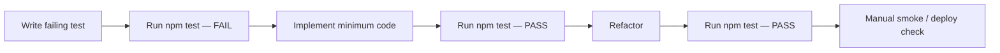
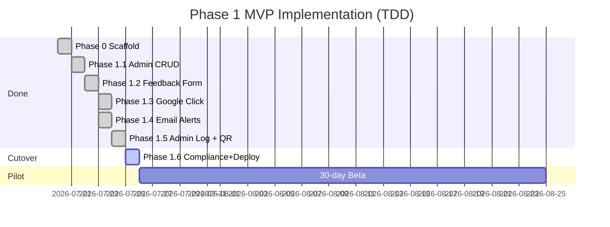

# Phase 1 MVP — Implementation Document (TDD)

**Product:** Commiters TrustTap  
**Phase:** 1 — Pilot MVP  
**Version:** 1.1  
**Last updated:** July 26, 2026  
**Methodology:** Test-Driven Development (Red → Green → Refactor)  
**Related documents:** [PHASE_1_ARCHITECTURE.md](./PHASE_1_ARCHITECTURE.md) · [PHASE_1_USE_CASES.md](./PHASE_1_USE_CASES.md) · [PHASE_1_USER_STORIES.md](./PHASE_1_USER_STORIES.md) · [PHASE_1_MVP_BRD.md](./PHASE_1_MVP_BRD.md)

---

## 1. Purpose

This document defines **how** to implement Phase 1 MVP using TDD. Each implementation phase follows:

1. **Red** — Write failing tests first (unit or integration).
2. **Green** — Write minimum code to pass tests.
3. **Refactor** — Clean up without breaking tests.
4. **Verify** — Run full suite + manual smoke test.

---

## 2. TDD Workflow



### Commands

```bash
npm run test:watch    # during development
npm test              # before every commit
npm run build         # before deploy
npm run dev           # manual smoke test
```

### Test file conventions

| Layer | Location | Naming |
|-------|----------|--------|
| Unit tests | `backend/lib/**/*.test.ts` | Co-located with source |
| Route tests | `backend/routes/**/*.test.ts` | Co-located with handlers |
| Compliance tests | `backend/lib/compliance.test.ts` | Cross-cutting rules |

### Mocking strategy (Phase 1)

| Dependency | Mock approach |
|------------|---------------|
| Prisma (`database/client`) | `vi.mock("@database/client")` in route tests |
| Nodemailer | `vi.mock("nodemailer")` in email tests |
| Environment | Set `process.env` in `beforeEach` |

---

## 3. Implementation Phase Overview

| Phase | Name | Duration | Status | Use Cases |
|-------|------|----------|--------|-----------|
| **0** | Project scaffold | 1 day | ✅ Done | — |
| **1.1** | Admin business CRUD | 1 day | ✅ Done | UC-06, UC-07, UC-08 |
| **1.2** | Feedback form UI + API hardening | 1 day | ✅ Done | UC-03 |
| **1.3** | Google click logging (frontend wire-up) | 0.5 day | ✅ Done | UC-02 |
| **1.4** | Phone alerts (WA/SMS) + email backup + idempotency | 1 day | 🔲 Required | UC-04 |
| **1.5** | Admin feedback log + QR export | 1 day | ✅ Done | UC-09, UC-10 |
| **1.6** | Compliance tests + deploy | 1 day | 🟡 Code done — production cutover pending credentials | UC-11, all COMP-* |
| **Beta** | 30-day pilot | 30 days | 🔲 Ready to start after deploy | All |

**Deploy runbook:** [PHASE_1_DEPLOY.md](./PHASE_1_DEPLOY.md) · **E2E manual (mobile-first):** [PHASE_1_E2E_MANUAL_TEST_GUIDE.md](./PHASE_1_E2E_MANUAL_TEST_GUIDE.md) · **Beta ops:** [PHASE_1_BETA_CHECKLIST.md](./PHASE_1_BETA_CHECKLIST.md)

**Total build estimate:** ~5 days after scaffold.

---

## 4. Phase 0 — Project Scaffold ✅ COMPLETE

### Delivered

- [x] `frontend/`, `backend/`, `database/` folder structure
- [x] Prisma schema + initial migration
- [x] Next.js App Router with thin re-exports
- [x] Admin login + middleware
- [x] Customer landing page (basic)
- [x] API route handlers (feedback, google-click, health, admin-login)
- [x] Vitest config + 12 passing unit tests
- [x] Production build verified

### Existing tests (baseline)

```
backend/lib/validators/index.test.ts   — 7 tests
backend/lib/rate-limit.test.ts         — 2 tests
backend/lib/auth/admin.test.ts         — 2 tests
backend/lib/email/smtp.test.ts         — 1 test
```

---

## 5. Phase 1.1 — Admin Business CRUD

**Goal:** Commiters admin can create, edit, and deactivate businesses.  
**Use cases:** UC-06, UC-07, UC-08  
**User stories:** US-D1, US-D2, US-D3

### 5.1 Tests to write first (Red)

Create `backend/lib/services/business.service.test.ts`:

```typescript
describe("businessService", () => {
  it("creates a business with valid input");
  it("rejects duplicate slug");
  it("rejects invalid googleReviewUrl");
  it("updates ownerEmail and googleReviewUrl");
  it("deactivates business (isActive = false)");
  it("finds active business by slug");
  it("returns null for inactive business slug");
});
```

Create `backend/routes/admin-businesses.test.ts`:

```typescript
describe("POST /api/admin/businesses", () => {
  it("returns 401 without admin cookie");
  it("returns 201 with valid payload");
  it("returns 400 for duplicate slug");
});

describe("PUT /api/admin/businesses/[id]", () => {
  it("updates business fields");
});

describe("PATCH /api/admin/businesses/[id]/deactivate", () => {
  it("sets isActive to false");
});
```

### 5.2 Implementation (Green)

| File | Action |
|------|--------|
| `backend/lib/services/business.service.ts` | **Create** — CRUD functions wrapping Prisma |
| `backend/routes/admin-businesses.ts` | **Create** — list, create, update, deactivate handlers |
| `frontend/app/api/admin/businesses/route.ts` | **Create** — thin re-export |
| `frontend/views/admin-businesses-page.tsx` | **Create** — list + create form |
| `frontend/components/admin/business-form.tsx` | **Create** — create/edit form component |
| `frontend/app/admin/businesses/page.tsx` | **Create** — route to view |

### 5.3 Refactor

- Extract shared validation to existing `businessInputSchema`.
- Ensure admin cookie check is reusable middleware helper.

### 5.4 Acceptance criteria

- [ ] Admin can create business in under 5 minutes (US-D1).
- [ ] Duplicate slug returns clear error.
- [ ] Invalid Google URL rejected at save time.
- [ ] Deactivated business returns 404 on `/r/{slug}`.
- [ ] All new tests pass: `npm test`.

### 5.5 Manual smoke test

1. Log in to `/admin`.
2. Create `cafe-edelweiss` with valid Google URL.
3. Visit `/r/cafe-edelweiss` — page loads.
4. Deactivate business — `/r/cafe-edelweiss` returns 404.

---

## 6. Phase 1.2 — Feedback Form UI + API Hardening

**Goal:** Customer can submit private feedback from a working form.  
**Use cases:** UC-03  
**User stories:** US-B1 – US-B5

### 6.1 Tests to write first (Red)

Create `backend/routes/feedback.test.ts`:

```typescript
describe("submitFeedback", () => {
  it("returns 201 for valid feedback");
  it("returns 400 for invalid rating");
  it("returns 400 when honeypot is filled");
  it("returns 404 for unknown slug");
  it("returns 404 for inactive business");
  it("returns 429 when rate limit exceeded");
  it("stores feedback with null comment when omitted");
  it("does NOT send alert when rating > 3");
});
```

Create `frontend/components/feedback/feedback-form.test.tsx` (optional Phase 1 — can be manual):

```typescript
describe("FeedbackForm", () => {
  it("requires rating before submit");
  it("includes hidden honeypot field");
  it("shows thank-you state after success");
});
```

### 6.2 Implementation (Green)

| File | Action |
|------|--------|
| `frontend/components/feedback/feedback-form.tsx` | **Create** — client component with stars + comment + honeypot |
| `frontend/components/feedback/star-rating.tsx` | **Create** — 1–5 star selector |
| `frontend/views/feedback-page.tsx` | **Update** — replace stub with form + thank-you states |
| `frontend/views/feedback-thank-you.tsx` | **Create** — thank-you view with Google CTA |
| `backend/routes/feedback.ts` | **Harden** — ensure inactive business check |

### 6.3 Refactor

- Extract `shouldTriggerAlert(rating: number): boolean` → `rating <= 3`.
- Shared error display component for form validation failures.

### 6.4 Acceptance criteria

- [ ] Form has rating (required) + comment (optional) only — no PII fields.
- [ ] Honeypot rejects bot submissions.
- [ ] Rate limit returns friendly error after threshold.
- [ ] Thank-you screen shows Google CTA (US-B4, COMP-2).
- [ ] All tests pass.

### 6.5 Manual smoke test

1. Open `/r/cafe-edelweiss/feedback`.
2. Submit 2-star feedback with comment.
3. See thank-you page with Google button.
4. Verify row in database (Prisma Studio or admin log).

---

## 7. Phase 1.3 — Google Click Logging

**Goal:** Track when customers tap the Google review CTA.  
**Use cases:** UC-02  
**User stories:** US-A2, US-A3

### 7.1 Tests to write first (Red)

Extend `backend/routes/google-click.test.ts`:

```typescript
describe("logGoogleClick", () => {
  it("returns 201 and creates feedback with clickedGoogle=true");
  it("returns 404 for unknown slug");
  it("returns 404 for inactive business");
  it("does not require rating or comment");
});
```

### 7.2 Implementation (Green)

| File | Action |
|------|--------|
| `frontend/components/google-review-button.tsx` | **Create** — calls `/api/google-click` then opens URL |
| `frontend/views/review-page.tsx` | **Update** — use GoogleReviewButton component |
| `frontend/views/feedback-thank-you.tsx` | **Update** — use GoogleReviewButton component |
| `backend/routes/google-click.ts` | **Harden** — add inactive business check |

### 7.3 Refactor

- Single `GoogleReviewButton` used on landing + thank-you (DRY compliance).

### 7.4 Acceptance criteria

- [ ] Google CTA opens correct URL in new tab (OQ-4 default).
- [ ] Click logged before redirect.
- [ ] Google click alone does NOT trigger email alert (US-C2).
- [ ] All tests pass.

### 7.5 Manual smoke test

1. Tap Google CTA on landing page.
2. Google review page opens.
3. Check DB: feedback row with `clickedGoogle=true`, `rating=null`.

---

## 8. Phase 1.4 — Phone Alerts (WhatsApp/SMS) + Email Backup

**Goal:** Owners receive **automated phone alerts** for low ratings; email is backup only.  
**Use cases:** UC-04  
**User stories:** US-C1 – US-C5

### Explicit non-goals
- Manual staff WhatsApp relay / dashboard babysitting
- Email-only as Phase 1 done criteria
- `wa.me` link inside email as the sole phone strategy

### 8.1 Tests to write first (Red)

- Phone provider client sends expected payload for ≤3★
- SMS fallback when WhatsApp fails (if both configured)
- Email backup always attempted
- Idempotent `alertSentAt`
- Feedback still saved if all channels fail
- Google-only click does not alert
- `shouldTriggerAlert` true for 1–3, false for 4–5

### 8.2 Implementation (Green)

| File | Action |
|------|--------|
| `backend/lib/phone/*` | **Create** — WhatsApp Business API and/or SMS client |
| `backend/lib/alerts/send-owner-alert.ts` | **Create** — orchestrate phone primary + email secondary |
| `backend/lib/alerts/should-trigger-alert.ts` | Keep / verify `rating <= 3` |
| `backend/lib/email/smtp.ts` | Keep as **backup** channel |
| Env | Add `WHATSAPP_*` and/or `SMS_*` credentials |

### 8.3 Refactor

- Single orchestrator used by feedback service; providers mocked in unit tests

### 8.4 Acceptance criteria

- [ ] Rating ≤ 3 triggers WhatsApp **or** SMS within ~60 seconds
- [ ] Email backup sent
- [ ] No duplicate alerts for same feedback ID
- [ ] Feedback saved if alert providers fail
- [ ] No human relay required
- [ ] All tests pass

### 8.5 Manual smoke test

1. Configure real WA or SMS + SMTP.
2. Submit 2★ feedback for a pilot business.
3. Confirm phone notification on owner device; confirm email backup.

---

## 9. Phase 1.5 — Admin Feedback Log + QR Export

**Goal:** Admin can review submissions and download printable QR codes.  
**Use cases:** UC-09, UC-10  
**User stories:** US-D4, US-D5

### 9.1 Tests to write first (Red)

Create `backend/lib/qr/generate-qr.test.ts`:

```typescript
describe("generateQrPng", () => {
  it("returns a PNG buffer for a valid URL");
  it("encodes the full public business URL");
});
```

Create `backend/routes/admin-feedback.test.ts`:

```typescript
describe("GET /api/admin/feedback", () => {
  it("returns 401 without admin cookie");
  it("returns feedback list for a business ordered by createdAt desc");
});
```

Create `backend/routes/admin-qr.test.ts`:

```typescript
describe("GET /api/admin/qr/[slug]", () => {
  it("returns PNG with correct content-type");
  it("returns 404 for unknown slug");
});
```

### 9.2 Implementation (Green)

| File | Action |
|------|--------|
| `backend/lib/qr/generate-qr.ts` | **Create** — wrap `qrcode` npm package |
| `backend/routes/admin-feedback.ts` | **Create** — list feedback by businessId |
| `backend/routes/admin-qr.ts` | **Create** — return PNG response |
| `frontend/views/admin-feedback-log-page.tsx` | **Create** — table of feedback entries |
| `frontend/components/admin/feedback-table.tsx` | **Create** — display component |
| `frontend/app/api/admin/feedback/route.ts` | **Create** — thin re-export |
| `frontend/app/api/admin/qr/[slug]/route.ts` | **Create** — thin re-export |
| `frontend/views/admin-businesses-page.tsx` | **Update** — add QR download + view feedback links |

### 9.3 Refactor

- Shared admin auth guard function used across all admin API routes.

### 9.4 Acceptance criteria

- [ ] Feedback log shows rating, comment, clickedGoogle, timestamp, alertSentAt.
- [ ] QR PNG downloads and scans correctly on mobile after lamination.
- [ ] All tests pass.

### 9.5 Manual smoke test

1. Download QR for pilot business.
2. Print/laminate and scan with phone.
3. View feedback log after test submissions.

---

## 10. Phase 1.6 — Compliance Tests + Production Deploy

**Goal:** Verify anti-gating rules in code; deploy to production.  
**Use cases:** UC-11 + all COMP-* rules  
**User stories:** US-E1, US-E2, US-F1, US-F2

### 10.1 Tests to write first (Red)

Create `backend/lib/compliance.test.ts`:

```typescript
describe("compliance: no review gating", () => {
  it("feedback route does not branch on rating for Google access");
  it("shouldTriggerAlert is separate from Google CTA logic");
});

describe("compliance: source scan", () => {
  it("frontend views do not contain gating copy patterns", () => {
    // Scan view files for prohibited strings like
    // "instead of leaving a review", "let us fix this instead"
  });
});
```

Create `backend/routes/health.test.ts`:

```typescript
describe("getHealthStatus", () => {
  it("returns ok when database is reachable");
  it("returns degraded when database fails");
});
```

### 10.2 Implementation (Green)

| File | Action |
|------|--------|
| `backend/lib/compliance/scan-copy.ts` | **Create** — optional static copy scanner for CI |
| All views | **Audit** — confirm Google CTA on landing + thank-you |
| `.env` on Vercel | **Configure** — all production env vars |
| DNS | **Configure** — CNAME for feedbackflow.commiters.in |

### 10.3 Deploy checklist

- [x] `npm test` — all tests green (local)
- [x] `npm run build` — production build succeeds (local)
- [x] Compliance + health tests added
- [x] Seed script prepared for 3 pilot businesses
- [ ] `npm run db:migrate:deploy` — migrations applied on production DB *(needs credentials)*
- [ ] `GET /api/health` returns `{ status: "ok" }` *(production)*
- [ ] Admin login works on production
- [ ] Test QR scan on real mobile device
- [ ] Test phone alert (WhatsApp or SMS) on owner device
- [ ] Test email backup on production SMTP
- [ ] Seed 3 pilot businesses with real Place IDs + phone numbers: `npm run db:seed`
- [ ] Print laminated QR boards **with merchant business name**

### 10.4 Acceptance criteria

- [x] Zero compliance test failures (local suite).
- [ ] Production URL live at `https://feedbackflow.commiters.in`.
- [ ] 3 pilot businesses configured and ready for print.

See [PHASE_1_DEPLOY.md](./PHASE_1_DEPLOY.md) for the full cutover runbook.

---

## 11. Phase Beta — 30-Day Pilot

**Not a build phase** — operational validation after deploy.

| Week | Activity |
|------|----------|
| Week 1 | Install laminated QRs at 3 cafés; verify scans work |
| Week 2 | Verify WhatsApp/SMS alerts with owners; fix provider/URL issues |
| Week 3 | Collect owner feedback; document 1 "caught issue" story |
| Week 4 | Review metrics: scans, feedback count, Google clicks |

### Success metrics (from BRD)

| Metric | Target |
|--------|--------|
| Active businesses | 3 |
| Total scans (30 days) | ≥ 50 |
| Private feedback submissions | ≥ 10 |
| Google clicks logged | ≥ 20 |
| Owner value story | ≥ 1 |
| Critical unresolved bugs | 0 |

---

## 12. Test Coverage Targets (Phase 1)

| Module | Target | Priority |
|--------|--------|----------|
| `backend/lib/validators/` | 100% | Must |
| `backend/lib/rate-limit.ts` | 100% | Must |
| `backend/lib/auth/` | 100% | Must |
| `backend/lib/alerts/` | 100% | Must |
| `backend/lib/email/smtp.ts` | 90% | Must |
| `backend/routes/feedback.ts` | 90% | Must |
| `backend/routes/google-click.ts` | 90% | Must |
| `backend/routes/admin-*.ts` | 80% | Should |
| `backend/lib/qr/` | 80% | Should |
| Frontend components | Manual smoke | Phase 1 acceptable |

---

## 13. Definition of Done (Phase 1 MVP)

Phase 1 is **done** when ALL of the following are true:

- [x] All implementation phases 1.1–1.5 complete; 1.6 code/tests complete
- [x] `npm test` passes with ≥ 30 tests
- [x] `npm run build` succeeds
- [ ] Deployed to `feedbackflow.commiters.in` *(credentials required — see PHASE_1_DEPLOY.md)*
- [ ] 3 pilot businesses seeded with correct Google URLs
- [ ] QR codes printed and installed at 3 Udaipur cafés *(Beta Week 1)*
- [x] Compliance tests pass (no gating logic)
- [ ] Owner **phone** alert (WhatsApp or SMS) verified end-to-end on production
- [ ] Email backup verified
- [ ] Physical QR boards printed with merchant names
- [ ] No PII collected from customers (form: rating + comment only)
- [ ] Product owner sign-off on BRD Section 16
- [ ] Manual alert-relay process is **not** part of operations

---

## 14. Implementation Order Diagram



---

## 15. Document Index

| Document | Purpose |
|----------|---------|
| [PHASE_1_MVP_BRD.md](./PHASE_1_MVP_BRD.md) | Business requirements |
| [PHASE_1_USER_STORIES.md](./PHASE_1_USER_STORIES.md) | User stories + acceptance criteria |
| [PHASE_1_USE_CASES.md](./PHASE_1_USE_CASES.md) | Formal use cases |
| [PHASE_1_ARCHITECTURE.md](./PHASE_1_ARCHITECTURE.md) | Technical architecture |
| **PHASE_1_IMPLEMENTATION.md** | This document — TDD build plan |
| [PHASE_1_DEPLOY.md](./PHASE_1_DEPLOY.md) | Production cutover runbook |
| [PHASE_1_E2E_MANUAL_TEST_GUIDE.md](./PHASE_1_E2E_MANUAL_TEST_GUIDE.md) | Pre-deploy mobile-first manual E2E |
| [PHASE_1_BETA_CHECKLIST.md](./PHASE_1_BETA_CHECKLIST.md) | 30-day pilot ops checklist |
| [PHASED_ROADMAP.md](./PHASED_ROADMAP.md) | Full product roadmap (Phases 1–4) |

---

*TDD rule for this project: if it is not tested, it is not done. Write the test first, then the code.*
