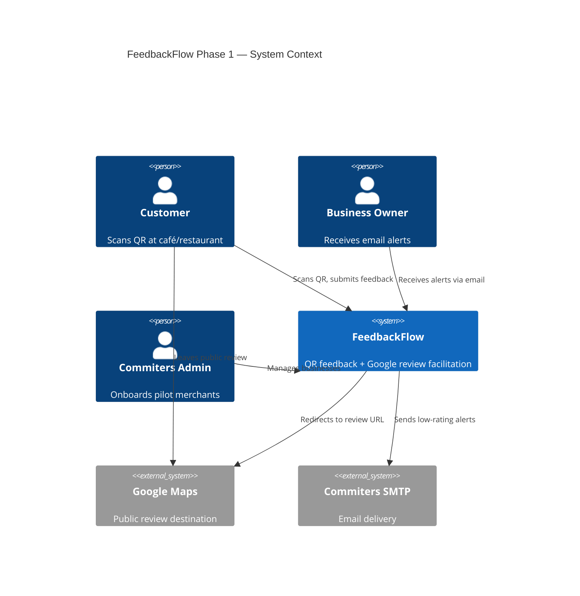

# Phase 1 MVP — Use Case Document

**Product:** Commiters FeedbackFlow  
**Phase:** 1 — Pilot MVP  
**Version:** 1.0  
**Last updated:** July 20, 2026  
**Related documents:** [PHASE_1_MVP_BRD.md](./PHASE_1_MVP_BRD.md) · [PHASE_1_USER_STORIES.md](./PHASE_1_USER_STORIES.md) · [PHASE_1_ARCHITECTURE.md](./PHASE_1_ARCHITECTURE.md) · [PHASE_1_IMPLEMENTATION.md](./PHASE_1_IMPLEMENTATION.md)

---

## 1. Purpose

This document describes **who** uses FeedbackFlow Phase 1, **what** they do, and **why** — expressed as formal use cases with preconditions, postconditions, main flows, and alternate flows.

It bridges business requirements (BRD) and technical implementation.

---

## 2. System Context

---

## 3. Actors

| Actor | Type | Description |
|-------|------|-------------|
| **Customer** | Primary external | Person visiting a pilot café/restaurant who scans a QR code |
| **Business Owner** | Primary external | Merchant who receives email alerts for low private feedback |
| **Commiters Admin** | Internal | Commiters team member who onboards and manages pilot businesses |
| **Google Maps** | External system | Destination for public Google reviews |
| **Commiters SMTP** | External system | Existing email infrastructure for owner alerts |

---

## 4. Use Case Summary

| ID | Use Case | Primary Actor | Priority |
|----|----------|---------------|----------|
| UC-01 | Scan QR and view landing page | Customer | Must |
| UC-02 | Leave a Google review | Customer | Must |
| UC-03 | Submit private feedback | Customer | Must |
| UC-04 | Receive low-rating alert | Business Owner | Must |
| UC-05 | Log in to admin panel | Commiters Admin | Must |
| UC-06 | Create a business | Commiters Admin | Must |
| UC-07 | Edit a business | Commiters Admin | Must |
| UC-08 | Deactivate a business | Commiters Admin | Must |
| UC-09 | View feedback log | Commiters Admin | Must |
| UC-10 | Download QR code | Commiters Admin | Should |
| UC-11 | Verify system health | Commiters Admin | Must |

---

## 5. Use Case Specifications

### UC-01: Scan QR and view landing page

| Field | Detail |
|-------|--------|
| **Primary actor** | Customer |
| **Goal** | See how to leave a Google review or send private feedback |
| **Preconditions** | Business exists, is active, QR is printed and displayed |
| **Postconditions** | Customer sees compliant landing page with equal Google access |

**Main flow:**
1. Customer scans QR encoding `https://feedbackflow.commiters.in/r/{slug}`.
2. System loads business by slug.
3. System displays business name, primary Google CTA, secondary private feedback link, privacy note, and Commiters footer.

**Alternate flows:**
- **1a. Slug not found:** System shows neutral 404 page.
- **1b. Business inactive:** System shows neutral 404 page.

**Business rules:**
- BR-COMP-1: Google CTA visible to all visitors without precondition.
- BR-COMP-6: Privacy note states feedback is anonymous.

---

### UC-02: Leave a Google review

| Field | Detail |
|-------|--------|
| **Primary actor** | Customer |
| **Goal** | Share experience on Google Maps |
| **Preconditions** | UC-01 completed; valid `googleReviewUrl` configured |
| **Postconditions** | Customer reaches Google review page; click optionally logged |

**Main flow:**
1. Customer taps **Leave a Google Review** on landing page.
2. System logs `clickedGoogle = true` (via API or server action).
3. System opens `googleReviewUrl` in a new browser tab.

**Alternate flows:**
- **2a. Customer on thank-you page:** Google CTA still available after private feedback.
- **2b. Logging fails:** Customer still reaches Google; error logged server-side only.

**Business rules:**
- BR-COMP-1: Google access never conditional on rating.
- BR-GGL-1: Default target is new tab.

---

### UC-03: Submit private feedback

| Field | Detail |
|-------|--------|
| **Primary actor** | Customer |
| **Goal** | Tell the business about their experience privately |
| **Preconditions** | UC-01 completed |
| **Postconditions** | Feedback stored; thank-you shown; alert triggered if rating ≤ 3 |

**Main flow:**
1. Customer taps **Send private feedback**.
2. System shows form: rating (1–5, required), comment (optional), honeypot (hidden).
3. Customer selects rating and optionally enters comment.
4. Customer submits form.
5. System validates input, checks rate limit, rejects honeypot if filled.
6. System stores feedback linked to business.
7. If rating ≤ 3, system triggers UC-04.
8. System shows thank-you page with Google CTA still visible.

**Alternate flows:**
- **3a. Rate limit exceeded:** Friendly error; no record stored.
- **3b. Honeypot filled:** Submission rejected silently or with generic error.
- **3c. Invalid rating:** Validation error shown.

**Business rules:**
- BR-FB-2: No customer name, phone, or email collected.
- BR-COMP-2: Google CTA remains on thank-you screen.
- BR-COMP-5: Internal rating never gates Google CTA.

---

### UC-04: Receive low-rating alert

| Field | Detail |
|-------|--------|
| **Primary actor** | Business Owner |
| **Goal** | Know immediately when a customer had a poor experience |
| **Preconditions** | UC-03 completed with rating ≤ 3; valid `ownerEmail` configured |
| **Postconditions** | Owner receives one email alert per feedback record |

**Main flow:**
1. System detects rating ≤ 3 on new feedback.
2. System builds email with business name, rating, comment, timestamp.
3. If `ownerWhatsApp` set, system includes `wa.me` deep link in email body.
4. System sends email via Commiters SMTP.
5. System sets `alertSentAt` on feedback record.

**Alternate flows:**
- **4a. SMTP failure:** Error logged; `alertSentAt` not set (manual retry in Phase 1).
- **4b. No WhatsApp number:** Email sends without wa.me link.
- **4c. Duplicate trigger:** Idempotency via `alertSentAt` prevents second email.

**Business rules:**
- BR-ALT-6: No alert for Google-only clicks.
- BR-ALT-7: One alert per feedback record.

---

### UC-05: Log in to admin panel

| Field | Detail |
|-------|--------|
| **Primary actor** | Commiters Admin |
| **Goal** | Access protected admin area |
| **Preconditions** | Admin knows `ADMIN_SECRET` env value |
| **Postconditions** | Valid session cookie set; admin can access `/admin` |

**Main flow:**
1. Admin navigates to `/admin/login`.
2. Admin enters admin secret.
3. System validates secret (timing-safe compare).
4. System sets httpOnly session cookie.
5. System redirects to `/admin`.

**Alternate flows:**
- **5a. Invalid secret:** 401 error; no cookie set.
- **5b. Already logged in:** Redirect to `/admin`.

---

### UC-06: Create a business

| Field | Detail |
|-------|--------|
| **Primary actor** | Commiters Admin |
| **Goal** | Onboard a new pilot merchant |
| **Preconditions** | UC-05 completed |
| **Postconditions** | Business record created; slug URL and QR available |

**Main flow:**
1. Admin opens create-business form in `/admin`.
2. Admin enters: name, slug, owner email, optional WhatsApp, Google review URL.
3. System validates slug uniqueness and Google URL format.
4. System saves business with `isActive = true`.
5. System displays public URL: `/r/{slug}`.

**Alternate flows:**
- **6a. Duplicate slug:** Validation error.
- **6b. Invalid Google URL:** Validation error with guidance.

---

### UC-07: Edit a business

| Field | Detail |
|-------|--------|
| **Primary actor** | Commiters Admin |
| **Goal** | Update merchant contact or Google URL |
| **Preconditions** | UC-05 completed; business exists |
| **Postconditions** | Updated data reflected on next customer page load |

**Main flow:**
1. Admin selects business from list.
2. Admin updates fields.
3. System validates and saves changes.

---

### UC-08: Deactivate a business

| Field | Detail |
|-------|--------|
| **Primary actor** | Commiters Admin |
| **Goal** | Disable a QR without deleting history |
| **Preconditions** | UC-05 completed; business exists |
| **Postconditions** | `isActive = false`; QR returns 404 |

**Main flow:**
1. Admin toggles business to inactive.
2. System updates `isActive`.
3. Customer scans old QR → neutral 404.

**Business rules:**
- Existing feedback records preserved for audit.

---

### UC-09: View feedback log

| Field | Detail |
|-------|--------|
| **Primary actor** | Commiters Admin |
| **Goal** | Review customer submissions for a business |
| **Preconditions** | UC-05 completed |
| **Postconditions** | Chronological feedback list displayed |

**Main flow:**
1. Admin selects business.
2. System loads feedback ordered by `createdAt DESC`.
3. System displays: rating, comment, `clickedGoogle`, timestamp, alert status.

---

### UC-10: Download QR code

| Field | Detail |
|-------|--------|
| **Primary actor** | Commiters Admin |
| **Goal** | Get printable QR for physical display |
| **Preconditions** | UC-06 completed |
| **Postconditions** | PNG downloaded encoding public URL |

**Main flow:**
1. Admin clicks **Download QR** for a business.
2. System generates PNG for `https://feedbackflow.commiters.in/r/{slug}`.
3. Admin prints and laminates for table display.

---

### UC-11: Verify system health

| Field | Detail |
|-------|--------|
| **Primary actor** | Commiters Admin / DevOps |
| **Goal** | Confirm app and database are operational |
| **Preconditions** | App deployed |
| **Postconditions** | Health status returned |

**Main flow:**
1. Admin or monitor calls `GET /api/health`.
2. System checks database connectivity.
3. System returns `{ status: "ok" }` or `{ status: "degraded" }`.

---

## 6. Use Case → User Story Traceability

| Use Case | User Stories |
|----------|--------------|
| UC-01 | US-A1, US-A4 |
| UC-02 | US-A2, US-A3 |
| UC-03 | US-B1 – US-B5 |
| UC-04 | US-C1 – US-C4 |
| UC-05 | (Admin auth — implicit) |
| UC-06 | US-D1 |
| UC-07 | US-D2 |
| UC-08 | US-D3 |
| UC-09 | US-D4 |
| UC-10 | US-D5 |
| UC-11 | US-F2 |
| All customer flows | US-E1, US-E2, US-F1 |

---

## 7. Compliance Use Cases (Cross-Cutting)

These are not separate user journeys but **mandatory constraints** on UC-01 through UC-03:

| Rule ID | Constraint | Applies to |
|---------|------------|------------|
| COMP-1 | Google CTA visible to 100% of visitors | UC-01, UC-03 |
| COMP-2 | Private feedback does not hide Google CTA | UC-03 |
| COMP-3 | No discouraging copy for negative reviewers | UC-01, UC-03 |
| COMP-4 | No incentives tied to Google reviews | All customer UC |
| COMP-5 | Rating never gates Google access | UC-03 |
| COMP-7 | Merchant staff must not pressure at table | Operational (out of app) |

---

## 8. Out of Scope (Phase 1)

The following are **not** use cases in Phase 1:

- Merchant self-registration
- Customer account creation
- Payment or subscription
- WhatsApp Business API send
- Multi-location QR per business
- Analytics dashboard for merchants
- Review gating by sentiment

---

*This document is the authoritative use case reference for Phase 1 MVP implementation and testing.*
